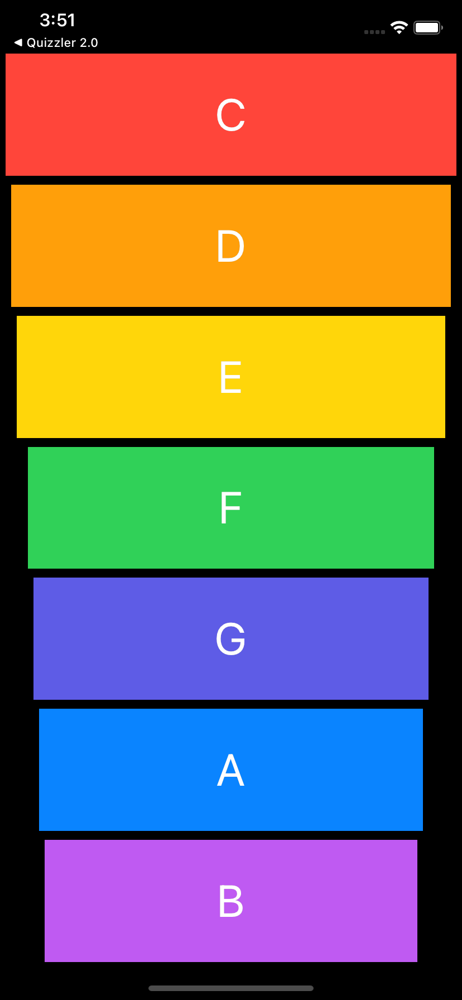

Xylophone, Developed by Sebastian Güiza, using Xcode and App Brewery

# *** Xylophone ***

This is a xylophone which you can use to play music

What I learned in this module was:

* How to play sound using AVFoundation and AVAudioPlayer.
* Understand Apple documentation and how to use StackOverflow.
* Functions and methods in Swift. 
* Data types.
* Swift loops.
* Variable scope.
* The ViewController lifecycle.
* Error handling in Swift.
* Code refactoring.
* Basic debugging.

Everybody who wants to use this application, ¡¡¡ 

## Enjoy it !!!

